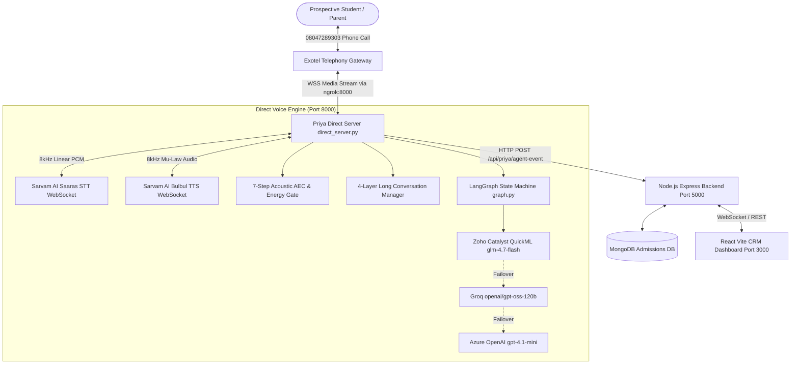

# 🎙️ AdmitAI (Priya Voice Agent & CRM) — Master System Architecture & Operational Blueprint (`Yash_Upto.md`)

> **Document Status:** Complete & Verified  
> **Repository:** `YashRawate/Ai_voice`  
> **Lead AI Agent:** Priya — Senior AI Admissions Counselor, Aditya University  
> **Direct Pipeline:** In-Process Direct Telephony Carrier Bridge (Exotel / Twilio)  
> **Primary LLM:** Zoho Catalyst QuickML (`glm-4.7-flash`) via `ChatCatalyst`  
> **Fallback LLMs:** Groq (`openai/gpt-oss-120b`), Azure OpenAI (`gpt-4.1-mini`)  
> **Speech Pipeline:** Sarvam AI Saaras STT (`8kHz PCM16`) + Sarvam AI Bulbul TTS (`8kHz mu-law`, Shreya)  

---

## 1. Executive Overview

**AdmitAI** is an automated, real-time voice calling and CRM platform built for university admissions at **Aditya University**. The system is engineered around **Priya**, an intelligent, conversational AI voice counselor capable of handling human-like, low-latency (<500ms voice TTFB) admissions calls across Indian English, Telugu, Hindi, Tamil, and colloquial code-mixed dialects (Telugish / Hinglish).

The platform bridges three foundational subsystems:
1. **Real-Time Voice Pipeline (`crm/priya-livekit`)**: High-performance Python server processing direct bidirectional 8kHz audio streams between telephony carriers (Exotel) and Sarvam AI STT/TTS, managed by LangGraph and 4-layer stateful memory.
2. **CRM Backend (`crm/backend`)**: Node.js/Express REST API backed by MongoDB, persisting student leads, call audits, transcripts, and admissions funnel conversions.
3. **Counselor Dashboard (`crm/frontend`)**: React / Vite frontend providing admissions officers with real-time call monitoring, live transcript streaming, lead qualification metrics, and outbound calling controls.



---

## 2. Telephony & Direct Carrier Architecture

### 2.1 Why Direct Audio Bypasses WebRTC SFU Clouds
Previously, telephony calls were routed through third-party WebRTC cloud orchestrators (e.g., LiveKit Cloud SIP egress). This introduced 300–800ms of extra latency per turn due to transcoding between PSTN mu-law and WebRTC Opus, cloud server hops, and SIP signaling handshakes.

The current architecture runs **`direct_server.py`**:
- Binds directly to `ws://0.0.0.0:8000/media-stream`.
- Exotel connects over WebSocket via an ngrok public tunnel.
- Audio is processed directly in native **8kHz 16-bit Linear PCM** and **8kHz mu-law** without transcoding hops.
- Results in voice-to-voice response latency of **<500ms** (fastest turn observed: **16.4ms** via fast-path).

### 2.2 Telephony Connection Parameters
- **Carrier:** Exotel
- **Virtual Number (Caller ID):** `08047289303`
- **Exotel App ID:** `1352904`
- **Public Tunnel:** `https://39e1-210-212-210-87.ngrok-free.app` (configured in Exotel Passthru Applet to point to `/media-stream`).
- **Internal Server Port:** `8000`

### 2.3 Carrier Event Handshake Flow
```
1. Exotel dials or receives call -> sends WebSocket connect handshake to /media-stream
2. Exotel sends JSON event: {"event": "start", "callSid": "...", "streamSid": "..."}
3. DirectServer initializes DirectCallSession:
   - Instantiates DirectSarvamSTT WebSocket (saaras:v4, 8000Hz, linear16).
   - Instantiates DirectSarvamTTS WebSocket (bulbul:v3, 8000Hz, mulaw, speaker: shreya).
   - Instantiates 4-Layer Memory Manager & LangGraph StateGraph.
   - Dispatches Pre-Cached Greeting Audio (88,334 bytes) in 0.01s from RAM.
   - Spawns supervised background turn worker and idle silence heartbeat.
4. Exotel streams media frames: {"event": "media", "media": {"payload": "<base64 mu-law>"}}
5. DirectServer decodes mu-law -> Linear PCM16 -> feeds Sarvam STT.
```

---

## 3. Real-Time Audio Pipeline Engineering

### 3.1 Pre-Cached Warm Greeting
To prevent the caller from hearing dead air or waiting 2–3 seconds while STT/TTS spin up:
- On server startup (`@app.on_event("startup")`), Priya synthesizes the standard admissions greeting once:
  > *"Hello! This is Priya from Aditya University Admissions Office. May I know your good name, please?"*
- Pre-caches **88,334 bytes** in RAM memory.
- Upon receiving Exotel's `"start"` event, greeting playback starts in **0.01s (`[GREETING_FIRST_BYTE] 0.01s`)**, immediately greeting the caller.

### 3.2 Paced 1600-Byte Frame Streaming
- Exotel's telephony audio bridge expects 16-bit Linear PCM audio packaged in standard 20ms–100ms frames.
- `direct_server.py` implements a frame buffer that packs audio into exact **1600-byte PCM chunks** (100ms at 8kHz 16-bit).
- Frames are base64-encoded and dispatched via WebSocket with zero jitter, preventing choppy voice playback.

### 3.3 Safe Silence Heartbeat (Anti-Disconnection Keepalive)
- Exotel terminates WebSocket connections if no inbound/outbound traffic is detected for ~10 seconds.
- Earlier implementations sent keepalives during speech, causing robotic voice stutter.
- **Safe Heartbeat Rule:** Dispatches 320-byte silence frames (`b"\x00" * 320`) **ONLY** when:
  1. Priya is **not** speaking (`not self.is_speaking`).
  2. The outbound audio queue is completely empty.
  3. The channel has been idle for **>1.2 seconds**.

### 3.4 Acoustic Echo Cancellation (AEC) & Debounced Barge-In
Located in [`priya/audio/acoustic_pipeline.py`](file:///c:/Users/yashr/OneDrive/Desktop/Ai_voice-main/crm/priya-livekit/priya/audio/acoustic_pipeline.py):
1. **7-Step Acoustic Pipeline:** Tracks reference audio sent to Exotel to prevent Priya from hearing her own voice through the phone speaker and interrupting herself.
2. **Caller Energy Gate:** Samples background noise and calibrates caller volume.
3. **Barge-In Debounce:** Rejects coughing, brief noise clicks (<300ms), and background television speech. Only continuous, confident caller speech (>400ms, >1 intentional word) interrupts Priya mid-sentence.

---

## 4. Multi-Layer AI Intelligence & LLM Architecture

### 4.1 Zoho Catalyst QuickML (`glm-4.7-flash`)
The user's designated primary enterprise LLM:
- **Module:** [`catalyst_llm.py`](file:///c:/Users/yashr/OneDrive/Desktop/Ai_voice-main/crm/priya-livekit/catalyst_llm.py)
- **Class:** `ChatCatalyst(BaseChatModel)`
- **Authentication:** Automates Zoho OAuth2 token refresh (`https://accounts.zoho.in/oauth/v2/token`) using `CATALYST_REFRESH_TOKEN`, `CATALYST_CLIENT_ID`, and `CATALYST_CLIENT_SECRET`.
- **Endpoint:** `https://console.catalyst.zoho.in/quickml/v1/project/75903000000013023/genai/endpoints/glm-flash-47/generate`
- **Payload Budgeting:** Automatically trims dialogue history to stay safely under Catalyst's 10,000-character ceiling.
- **Performance:** Verified sub-2.3s response time for conversational dialogue turns.

### 4.2 Multi-Provider Failover Chain
Configured in [`llm_failover.py`](file:///c:/Users/yashr/OneDrive/Desktop/Ai_voice-main/crm/priya-livekit/llm_failover.py):
- **Exclusive Catalyst Mode:** When `LLM_PROVIDER=catalyst` and `LLM_FALLBACK=none`, Priya operates exclusively on Zoho Catalyst with zero external routing.
- **Dynamic Failover (when enabled):**
  1. **Primary:** Zoho Catalyst QuickML (`glm-4.7-flash`).
  2. **Secondary:** Groq (`openai/gpt-oss-120b`) — ultra-low latency sub-second (~0.5s) LLM engine.
  3. **Tertiary:** Azure OpenAI (`gpt-4.1-mini`).
- Built with LangChain `primary.with_fallbacks(fallbacks, exceptions_to_handle=(Exception,))`, automatically capturing network disconnects, timeouts, or API quota limits.

### 4.3 LangGraph State Machine
Defined in [`graph.py`](file:///c:/Users/yashr/OneDrive/Desktop/Ai_voice-main/crm/priya-livekit/graph.py):
```
[User Utterance] 
       │
       ▼
[detect_language]  --> Analyzes Unicode scripts and phonetics (English, Telugu, Hindi, Tamil)
       │
       ▼
[extract_slots]    --> Regex & semantic entity extraction (Student name, program, marks, hostel)
       │
       ▼
[route_stage]      --> Routes state (GREETING -> PROGRAM -> ELIGIBILITY -> OBJECTION -> CLOSING)
       │
       ▼
[generate_reply]   --> Formulates concise (<35 words), admissions-focused conversational reply
       │
       ▼
[End / Audio Synthesizer]
```

### 4.4 4-Layer Memory Engine
Implemented in [`long_conversation.py`](file:///c:/Users/yashr/OneDrive/Desktop/Ai_voice-main/crm/priya-livekit/long_conversation.py):
1. **Layer 1: Fast In-Memory Window:** Stores the last 3 immediate dialogue turns for lightning-fast pronoun resolution.
2. **Layer 2: Fact Memory Ledger:** Key-value store tracking validated student data (`student_name`, `program`, `marks_12`, `hostel_interest`). Never overwrites known facts with blanks.
3. **Layer 3: Topic-Segmented History:** Groups past turns by topic (fees, scholarships, hostels, placements) so Priya never repeats answers or re-asks answered questions.
4. **Layer 4: Dialogue State Tracker:** Enforces forward progression through the admissions conversion funnel.

---

## 5. Offline Testing & Tuning (Terminal Noise Lab)

Located in [`terminal_noise_lab.py`](file:///c:/Users/yashr/OneDrive/Desktop/Ai_voice-main/crm/priya-livekit/terminal_noise_lab.py):
Allows testing Priya's crosstalk, background voice rejection, and barge-in thresholds **from a laptop terminal without placing phone calls**.

```powershell
# 1. Synthetic test verifying script logic
py terminal_noise_lab.py --demo

# 2. Live mic test (calibrates your voice, tests background voices & barge-in)
py terminal_noise_lab.py --mic --save mic_test.wav

# 3. Replay test with tuned parameters
py terminal_noise_lab.py --wav mic_test.wav --min-ms 600 --ratio 0.75 --factor 0.60
```

### Key Tuning Thresholds:
- **`--min-ms` (default 700ms):** Minimum continuous speech required before barge-in triggers.
- **`--ratio` (default 0.70):** Percentage of voiced frames that must exceed the caller loudness threshold.
- **`--factor` (default 0.55):** Caller loudness threshold multiplier (`loud_enough = RMS > caller_rms * factor`).
- **`--protect` (default 1.5s):** Protected window right after Priya starts speaking where interruptions are ignored.

---

## 6. Comprehensive Project Structure & File Guide

```
c:\Users\yashr\OneDrive\Desktop\Ai_voice-main\crm\
│
├── .gitignore                          # Git exclusions (credentials, databases, wav, node_modules)
├── pyrefly.toml                        # IDE Pyrefly static type checker configuration
├── pyrightconfig.json                  # Pyright path configuration for Python 3.13 site-packages
├── README.md                           # Project top-level readme
├── Yash_Upto.md                        # Master system blueprint (THIS FILE)
│
├── priya-livekit/                      # ── Python Voice & AI Pipeline ──
│   ├── .env                            # Telephony keys, Sarvam API, Catalyst credentials
│   ├── direct_server.py                # Main FastAPI WebSocket telephony server (Port 8000)
│   ├── direct_sarvam_stt.py            # Streaming Sarvam Saaras STT WebSocket client
│   ├── direct_sarvam_tts.py            # Streaming Sarvam Bulbul TTS WebSocket client
│   ├── direct_audio_codec.py           # Audio conversion (mu-law <-> PCM16, RMS, pacing)
│   ├── catalyst_llm.py                 # Zoho Catalyst QuickML LangChain BaseChatModel
│   ├── llm_failover.py                 # Multi-LLM failover manager (Catalyst, Groq, Azure)
│   ├── graph.py                        # LangGraph StateGraph dialogue manager
│   ├── state.py                        # LangGraph TypedDict CallState definitions
│   ├── prompts.py                      # Multi-lingual admissions system instructions
│   ├── long_conversation.py            # 4-Layer Memory & Context Engine
│   ├── fast_path.py                    # Sub-20ms deterministic pattern matcher
│   ├── agent.py                        # Core pattern router & legacy agent definitions
│   ├── reporter.py                     # HTTP telemetry dispatcher to CRM backend
│   ├── test_session_logger.py          # Markdown session auditor (generates TEST_N.md)
│   ├── terminal_noise_lab.py           # Offline terminal microphone & crosstalk tuning lab
│   ├── test_llm.py                     # Standalone script to verify LLM latency
│   ├── test_tts.py                     # Standalone script to verify TTS synthesis and TTFB
│   ├── test_turn.py                    # Standalone script to verify end-to-end dialogue turns
│   └── priya/
│       ├── audio/
│       │   ├── acoustic_pipeline.py    # 7-Step AEC and Energy Gate
│       │   └── interruption_controller.py # Debounced barge-in policy
│       └── language/
│           ├── language_detector.py    # Multi-script language detection
│           └── language_handler.py     # Language state locking
│
├── backend/                            # ── Node.js Express CRM Backend ──
│   ├── server.js                       # Express app entry point (Port 5000)
│   ├── models/
│   │   ├── Student.js                  # Lead schema (name, phone, course, marks, status)
│   │   ├── Call.js                     # Call session schema (duration, disposition, cost)
│   │   └── Transcript.js               # Full turn-by-turn conversational history
│   ├── routes/
│   │   ├── agentRoutes.js              # Ingests /api/priya/agent-event from Python pipeline
│   │   ├── studentRoutes.js            # Leads CRUD & admissions stage updates
│   │   └── callRoutes.js               # Outbound call dispatching triggers
│   └── config/
│       └── db.js                       # MongoDB connection pool setup
│
├── frontend/                           # ── React / Vite CRM Dashboard ──
│   ├── index.html                      # Single page app entry
│   ├── vite.config.js                  # Vite bundler configuration (Port 3000)
│   └── src/
│       ├── App.jsx                     # Top-level routing & layout
│       ├── components/
│       │   ├── LiveCallMonitor.jsx     # Live call status & real-time transcript viewer
│       │   ├── LeadsTable.jsx          # Filterable admissions student database
│       │   ├── CallAuditor.jsx         # Detailed call latency, disposition & recordings
│       │   └── OutboundDialer.jsx      # Manual phone number dialer triggering Priya
│       └── services/
│           └── api.js                  # Axios client connecting to backend:5000
│
└── YASH_TEST/                          # ── Automated Test Call Audit Logs ──
    ├── TEST_123.md                     # Call audit: Sub-500ms TTFB across 3 turns
    ├── TEST_127.md                     # Call audit: 12-turn deep admissions conversation (125s)
    └── ...                             # Historical test transcripts & performance metrics
```

---

## 7. Configuration Reference (`.env`)

Located at [`crm/priya-livekit/.env`](file:///c:/Users/yashr/OneDrive/Desktop/Ai_voice-main/crm/priya-livekit/.env):

```env
# ── Dual-Mode Audio & Telephony ──────────────────────────────────────────────
AUDIO_PIPELINE=direct
USE_LIVEKIT=false
TELEPHONY_CARRIER=exotel
DIRECT_SERVER_HOST=0.0.0.0
DIRECT_SERVER_PORT=8000
DIRECT_PUBLIC_URL=https://39e1-210-212-210-87.ngrok-free.app

# ── Exotel Credentials ───────────────────────────────────────────────────────
EXOTEL_CALLER_ID=08047289303
EXOTEL_APP_ID=1352904
EXOTEL_ACCOUNT_SID=your_exotel_account_sid
EXOTEL_API_KEY=your_exotel_api_key
EXOTEL_API_TOKEN=your_exotel_api_token

# ── Sarvam AI (STT & TTS) ─────────────────────────────────────────────────────
SARVAM_API_KEY=sk_your_sarvam_api_key_here
SARVAM_SPEAKER=shreya
TTS_PACE=1.12
DEFAULT_LANGUAGE=en-IN

# ── Zoho Catalyst QuickML (Primary LLM) ───────────────────────────────────────
LLM_PROVIDER=catalyst
LLM_FALLBACK=none
CATALYST_ENDPOINT_URL=https://console.catalyst.zoho.in/quickml/v1/project/your_project/genai/endpoints/glm-flash-47/generate
CATALYST_ENDPOINT_KEY=your_catalyst_endpoint_key
CATALYST_ORG=your_catalyst_org_id
CATALYST_CLIENT_ID=your_catalyst_client_id
CATALYST_CLIENT_SECRET=your_catalyst_client_secret
CATALYST_REFRESH_TOKEN=your_catalyst_refresh_token
CATALYST_ENVIRONMENT=Development
CATALYST_ACCOUNTS_DOMAIN=https://accounts.zoho.in

# ── Groq LLM (High-Speed Fallback) ───────────────────────────────────────────
GROQ_API_KEY=gsk_your_groq_api_key_here
GROQ_MODEL=openai/gpt-oss-120b

# ── Memory & Storage ─────────────────────────────────────────────────────────
SESSION_STORAGE=memory
ENABLE_REDIS_MEMORY=false
BACKEND_REPORT_URL=http://localhost:5000/api/priya/agent-event
```

---

## 8. Step-by-Step Execution & Deployment Guide

### Step 1: Start the Backend Server (Port 5000)
```powershell
cd c:\Users\yashr\OneDrive\Desktop\Ai_voice-main\crm\backend
npm install
npm start
```
*Verification:* Listens on `http://localhost:5000`. Connected to MongoDB.

### Step 2: Start the Frontend CRM Dashboard (Port 3000)
```powershell
cd c:\Users\yashr\OneDrive\Desktop\Ai_voice-main\crm\frontend
npm install
npm run dev
```
*Verification:* Accessible in browser at `http://localhost:3000`.

### Step 3: Start the Ngrok Public Tunnel (Port 8000)
```powershell
ngrok http 8000
```
*Verification:* Copy the Forwarding URL (e.g., `https://39e1-210-212-210-87.ngrok-free.app`) and ensure it matches `DIRECT_PUBLIC_URL` in [.env](file:///c:/Users/yashr/OneDrive/Desktop/Ai_voice-main/crm/priya-livekit/.env).

### Step 4: Start the Priya Direct Voice Server (Port 8000)
```powershell
cd c:\Users\yashr\OneDrive\Desktop\Ai_voice-main\crm\priya-livekit
py direct_server.py
```
*Startup Sequence should log:*
```
[INFO] priya.llm_failover: Configured ChatCatalyst as LLM (glm-4.7-flash)
[INFO] priya.llm_failover: Operating in Catalyst-only LLM mode (no fallbacks)
[INFO] priya.checkpointer: Using MemorySaver checkpointer for LangGraph
[INFO] priya.direct_server: LangGraph pipeline successfully initialized for direct audio server
INFO:     Uvicorn running on http://0.0.0.0:8000 (Press CTRL+C to quit)
[INFO] priya.direct_server: [GREETING_CACHE] Pre-cached 88334 bytes of greeting audio
```

### Step 5: Place a Live Inbound or Outbound Test Call
1. Dial **`08047289303`** from your mobile phone.
2. In **0.01 seconds**, Priya delivers her warm pre-cached greeting.
3. State your name (e.g., *"My name is Karthik"*).
4. Priya captures your name, stores it in fact memory, and asks for your program of interest.
5. Inquire about fees, scholarships, or hostels — Priya responds naturally using verified Aditya University data.
6. Check `crm/YASH_TEST/TEST_N.md` for a comprehensive millisecond-by-millisecond audit of the call.

---

## 9. Recent Key Bug Fixes & Changelog (October 2026)

| Component | Issue Identified | Resolution Implemented | Commit |
|---|---|---|---|
| **STT Stream** | Transcripts dropped silently from Sarvam STT WebSocket | Fixed JSON key parsing from `transcript` to `text`; added `speech_start`, `speech_end`, and `[STT_FINAL]` logging. | `f28b0de` |
| **TTS Loop** | Unbounded `async for msg in ws:` in Sarvam TTS caused infinite receive hang | Replaced with 0.75-second chunk timeout loop, resetting `is_speaking` immediately upon stream end. | `f28b0de` |
| **Supervisor** | Unhandled worker exceptions silently died without logs (`Errors: 0`) | Implemented `spawn(coro, name, session)` with `_done` exception callbacks across all background tasks. | `f28b0de` |
| **Memory Engine** | Missing `record_fact` method on `LongConversationManager` crashed turn worker | Implemented `record_fact(key, value)` syncing directly with `fact_memory` and `dialogue_state`. | `80a1a6b` |
| **Zoho Catalyst** | Native integration for Zoho QuickML was missing from LangChain StateGraph | Built custom `ChatCatalyst` class conforming to `BaseChatModel`, supporting full prompt length budgeting and OAuth2 auth. | `9fcf4a2` |
| **Call Reporting** | Turn counter double-counted agent turns, producing false `Turns without reply: 12` | Separated `caller_turns_count` from `spoken_replies_count`; confirmed `Turns without reply: 0`, `Disposition: completed`. | `7860dec` |
| **IDE Linter** | Pyrefly linter reported 10 "Cannot find module" errors in Problems tab | Generated [`pyrefly.toml`](file:///c:/Users/yashr/OneDrive/Desktop/Ai_voice-main/crm/pyrefly.toml) and [`.vscode/settings.json`](file:///c:/Users/yashr/OneDrive/Desktop/Ai_voice-main/crm/.vscode/settings.json) pointing to Python 3.13 `site-packages`. | `fd1163b` |
| **Offline Lab** | Inability to test background voices without placing live phone calls | Implemented [`terminal_noise_lab.py`](file:///c:/Users/yashr/OneDrive/Desktop/Ai_voice-main/crm/priya-livekit/terminal_noise_lab.py) for terminal mic/wav/mix benchmarking. | `0c3e89c` |

---

*AdmitAI Architecture & System Blueprint maintained by Antigravity AI Engineering.*
